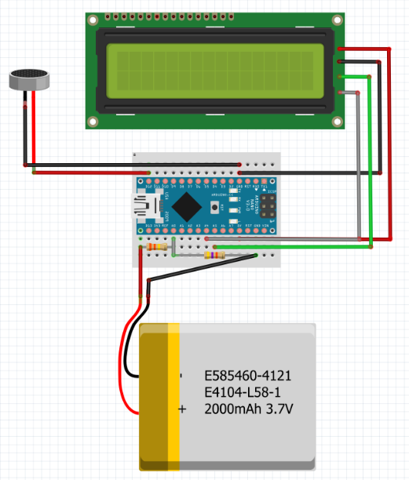

# Robo-Cybertruck Project

## Team 6: Max Lee, Wenhan Tang, Hannes Du, and Sherry Tao

## Project Overview
Our project, "Robo-Cybertruck," aims to create an autonomous vehicle capable of detecting low battery levels and navigating to a charging station using the Google Maps API. We also explored stretch goals such as self-parking and self-charging capabilities.

### Must-Haves:
- **Low Battery Detection:** Detect when the battery voltage drops below a certain threshold.
- **Navigation to Charging Station:** Navigate to a pre-defined charging station via the Google Maps API when low voltage is detected.

### Stretch Goals:
- **Self-Parking:** Implement self-parking capabilities.
- **Self-Charging:** Enable the vehicle to autonomously dock and charge itself.

## Parts Used
- **Arduino Nano:** For voltage detection.
- **GPS Module:** For navigation.
- **Resin-Printed Cybertruck Body**
- **Jetson Nano:** For processing and control.
- **LCD Screen**
- **Passive Buzzer**

## Low Voltage Detection: Circuit and Hardware
We designed a circuit that continuously checks for low battery voltage using a voltage divider connected to the Arduino Nano. When the voltage drops below the threshold, the Arduino triggers an alert by playing a song through a passive buzzer.

### Circuit Components:
- **Battery JST**
- **Voltage Divider**
- **Arduino Nano**
- **LCD Screen**
- **Passive Buzzer**

### Hardware Implementation:
- The hardware setup continuously monitors the battery voltage.
- Once a low voltage is detected, the system plays a song to alert the user.

### Arduino Code:
The Arduino code for voltage detection was implemented and tested, ensuring reliable low voltage alerts.

### Video Demonstration:
A video demonstration showcasing the voltage detection functionality was created.

## GPS Navigation: Overview
Upon detecting low voltage, the Robo-Cybertruck self-navigates to a designated parking spot using GPS coordinates.

### Concept:
- **Self-Navigation:** The vehicle autonomously navigates to a parking spot once low voltage is detected.

### Method:
- **Manage.py Modification:** We modified the `manage.py` script to handle GPS navigation.
- **Coordinate Conversion:** Latitude and longitude coordinates were converted to UTM coordinates for accurate navigation.
- **Current GPS Acquisition:** The vehicle's current GPS coordinates were continuously acquired and updated.

### Google Maps API:
We integrated the Google Maps API to automatically generate a path and a set of coordinates to the desired destination based on the vehicle's current GPS location.

### Video Demonstration:
A video demonstration showcasing the GPS navigation functionality was created.

## Manage.py Script Flow Chart
The `manage.py` script handles the navigation process through two main threads:

- **Thread 1: Drive**
  - Constantly checks the GPS location in coordinates.
- **Thread 2: Check Voltage**
  - Constantly checks the voltage via the Arduino serial port.
  - Plays music when low voltage is detected.
  - Updates the latest longitude/latitude from the drive after converting coordinates.

### Script Flow:
1. **Low Voltage Detected:** The system plays music.
2. **Get Latest Coordinates:** Updates the vehicle's coordinates.
3. **Google Maps API:** Generates the path to the charging station.
4. **Manual Driving:** Until low voltage is detected.
5. **Path Following:** Manually initiates the follow path on remote.

### Script Details:
- Constantly checks GPS location.
- Overrides `Donkey.csv` with new coordinates.
- Converts units from longitude/latitude to UTM coordinates.
- Navigates and stops at the charging station.

## Parking (Stretch Goal)
Our goal was to implement self-parking abilities, including parallel or lane parking. 

### Achievements:
- Utilized a low-budget yellow caution sign to indicate the parking spot.
- Observed a deviation of 1-2 meters from the true parking spot coordinates.

### Challenges:
- The car must be approximately facing the Google Maps generated path.
- GPS accuracy was a limiting factor.

## Gantt Chart
A Gantt chart detailing the project timeline and milestones was created and followed throughout the project.

## Conclusion
Team 6 successfully implemented the core features of the Robo-Cybertruck, including low battery detection and navigation to a charging station using the Google Maps API. While we faced challenges with GPS accuracy and self-parking implementation, the project provided valuable insights and experience in autonomous vehicle development.

For more details, code, and demonstration videos, please refer to our GitHub repository.

---

Thank you for your interest in our Robo-Cybertruck project! If you have any questions or feedback, feel free to open an issue or contact us via GitHub.
